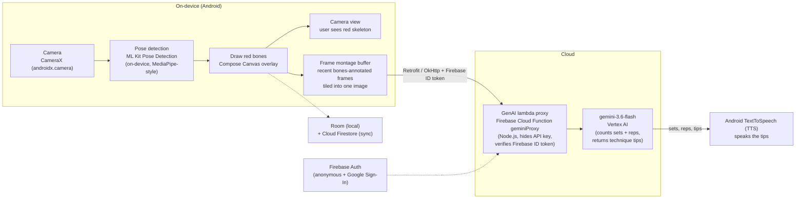

An Android-native AI fitness coach. It turns any phone camera into a personal trainer: real-time form feedback, a conversational Gemini coach, and personalized programs. Gamification drives return visits.

# Run and deploy your AI Studio app

## 🎥 Videos

- **Pitch:** 
- **Demo:** 

This contains everything you need to run your app locally.

View your app in AI Studio: https://ai.studio/apps/8d996e7e-f59e-43ed-9ef4-a8dc23f98d46

## 🏗️ Architecture

The workout-analysis pipeline runs pose detection on-device, annotates each frame with a red skeleton, tiles recent frames into a single montage, and sends it through a Firebase Cloud Function proxy to a Vertex AI model that counts sets/reps and returns technique tips — which are then spoken aloud via TextToSpeech.

### Tech stack

| Layer | Technology |
| --- | --- |
| Language | Kotlin |
| UI | Jetpack Compose |
| Camera | CameraX |
| Pose/ML | ML Kit Pose Detection |
| Overlay | Compose Canvas, red bones |
| Networking | Retrofit + OkHttp |
| Backend proxy | Firebase Cloud Functions, Node.js |
| LLM | Vertex AI gemini-3.6-flash |
| Auth | Firebase Auth |
| Local DB | Room |
| Cloud sync | Cloud Firestore |
| Voice | Android TextToSpeech |

## Run Locally

**Prerequisites:**  [Android Studio](https://developer.android.com/studio)

1. Open Android Studio
2. Select **Open** and choose the directory containing this project
3. Allow Android Studio to fix any incompatibilities as it imports the project.
4. Create a file named `.env` in the project directory and set `GEMINI_API_KEY` in that file to your Gemini API key (see `.env.example` for an example)
5. Remove this line from the app's `build.gradle.kts` file: `signingConfig = signingConfigs.getByName("debugConfig")`
6. Run the app on an emulator or physical device
